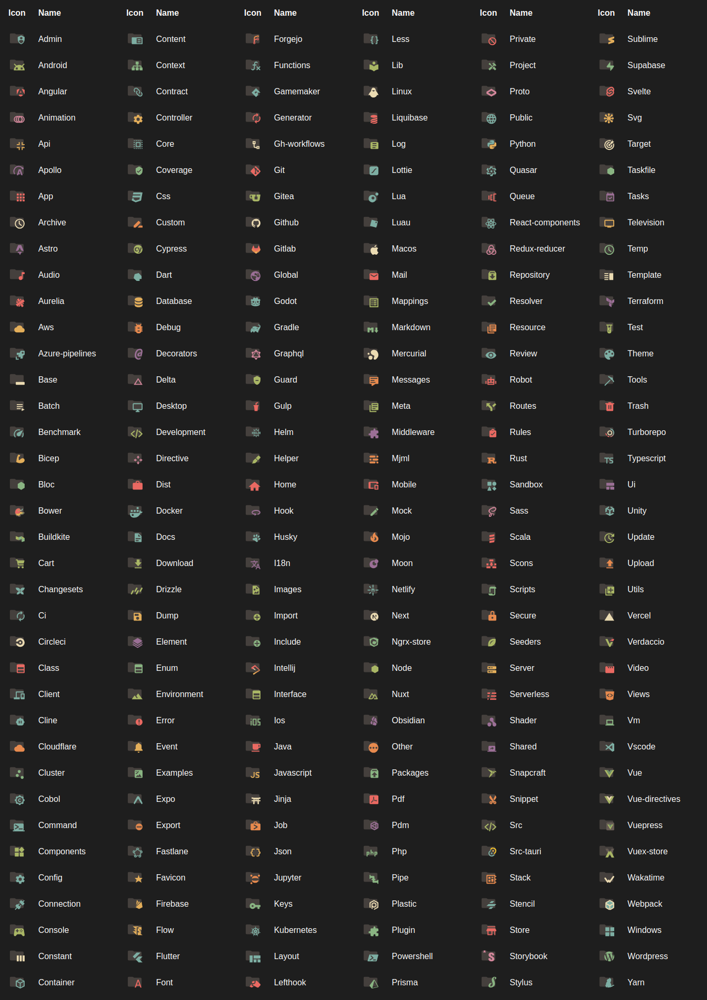

<h1 align="center">
   
  
   
   
    Gruvbox Material Icons
   
</h1>

<h3 align="center">Based on 
<a href="https://github.com/PKief/vscode-material-icon-theme">Material Icon Theme</a> 
by Philipp Kief
</h3>

<!-- https://shields.io/badges/static-badge -->

  &nbsp;
  &nbsp;
  &nbsp;

<h2 align="center">Folder Theme: Specific</h2>

<h2 align="center">Folder Theme: Colorful</h2>

<h2 align="center">Icon Pack</h2>

## Commands

Press `Ctrl-Shift-P` to open the command palette and type `Gruvbox Material Icons`.

#

| Command                           | Description                                                                         |
| --------------------------------- | ----------------------------------------------------------------------------------- |
| **Activate Icon Theme**           | Activate the icon theme.                                                            |
| **Change File Color**             | Change the color of the file icons.                                                 |
| **Change Folder Color**           | Change the color of the folder icons.                                               |
| **Change Folder Theme**           | Change the design of the folder icons.                                              |
| **Change Opacity**                | Change the opacity of the icons.                                                    |
| **Change Saturation**             | Change the saturation value of the icons.                                           |
| **Configure Icon Packs**          | Selects an icon pack that enables additional icons (e.g. for Angular, React, Ngrx). |
| **Toggle Explorer Arrows**        | Show or hide the arrows next to the folder icons.                                   |
| **Restore Default Configuration** | Reset to the default configuration.                                                 |
| **Toggle Grayscale**              | Set icon saturation to `0` (grayscale), or `1` (color).                             |
